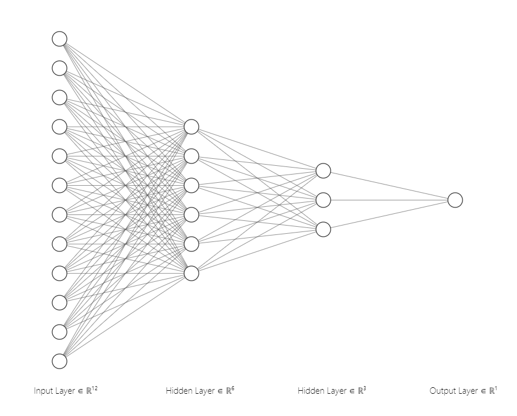
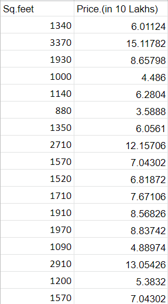
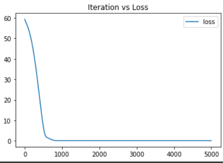
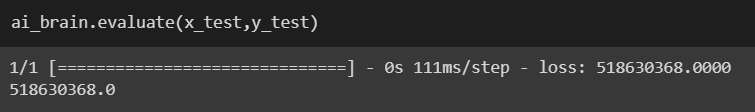
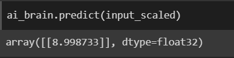

## EX:1 Developing a Neural Network Regression Model

## AIM

To develop a neural network regression model for the given dataset.

## THEORY

Training the algorithm to predict the price of house with square feet values.

## Neural Network Model



## DESIGN STEPS

### STEP 1:

Loading the dataset

### STEP 2:

Split the dataset into training and testing

### STEP 3:

Create MinMaxScalar objects ,fit the model and transform the data.

### STEP 4:

Build the Neural Network Model and compile the model.

### STEP 5:

Train the model with the training data.

### STEP 6:

Plot the performance plot

### STEP 7:

Evaluate the model with the testing data.

## PROGRAM
## Developed by: MOHANRAJ S
## Register no:212221230065S
```
from google.colab import auth
import gspread
from google.auth import default
import pandas as pd

auth.authenticate_user()
creds, _ = default()
gc = gspread.authorize(creds)

worksheet = gc.open('PricePrediction').sheet1
rows = worksheet.get_all_values()
df1 = pd.DataFrame(rows[1:], columns=rows[0])

df=df1.drop(["lakhs","Price"],axis=1)
df.head()

df.dtypes

df=df.astype({'Sq.feet':'float'})
df=df.astype({'Price.(in Lakhs)':'float'})

x=df[['Sq.feet']].values
y=df[['Price.(in Lakhs)']].values
x
y


from sklearn.model_selection import train_test_split
from sklearn.preprocessing import MinMaxScaler
from tensorflow.keras.models import Sequential
from tensorflow.keras.layers import Dense

x_train,x_test,y_train,y_test=train_test_split(x,y,test_size=0.33,random_state=50)

scaler=MinMaxScaler()
scaler.fit(x_train)
x_train_scaled = scaler.transform(x_train)
x_train_scaled

ai_brain = Sequential([
    Dense(12,activation='relu'),
    Dense(6,activation='relu'),
    Dense(3,activation='relu'),
    Dense(1)
])
ai_brain.compile(optimizer='rmsprop',loss='mse')

ai_brain.fit(x=x_train_scaled,y=y_train,epochs=5000) 

loss_df=pd.DataFrame(ai_brain.history.history)
loss_df.plot()
import matplotlib.pyplot as plt
plt.title("Iteration vs Loss")

x_test

x_test_scaled=scaler.transform(x_test)
x_test_scaled

ai_brain.evaluate(x_test,y_test)

input=[[2000]]
input_scaled=scaler.transform(input)
input_scaled.shape

input_scaled

ai_brain.predict(input_scaled)
```


## Dataset Information



## OUTPUT

### Training Loss Vs Iteration Plot



### Test Data Root Mean Squared Error



### New Sample Data Prediction



## RESULT

Thus the price of the house is predicted.
